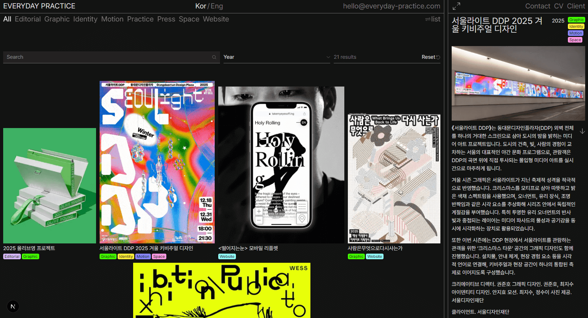
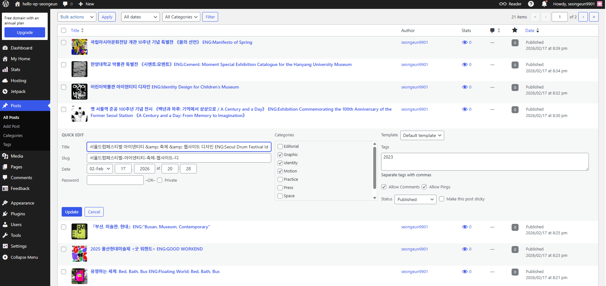
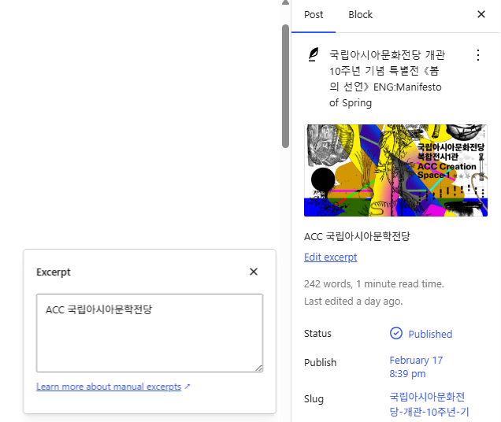
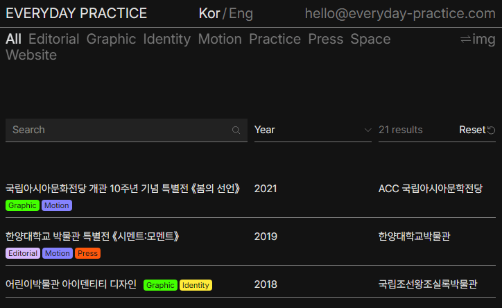
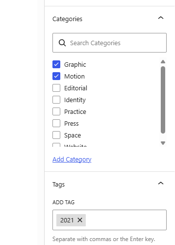
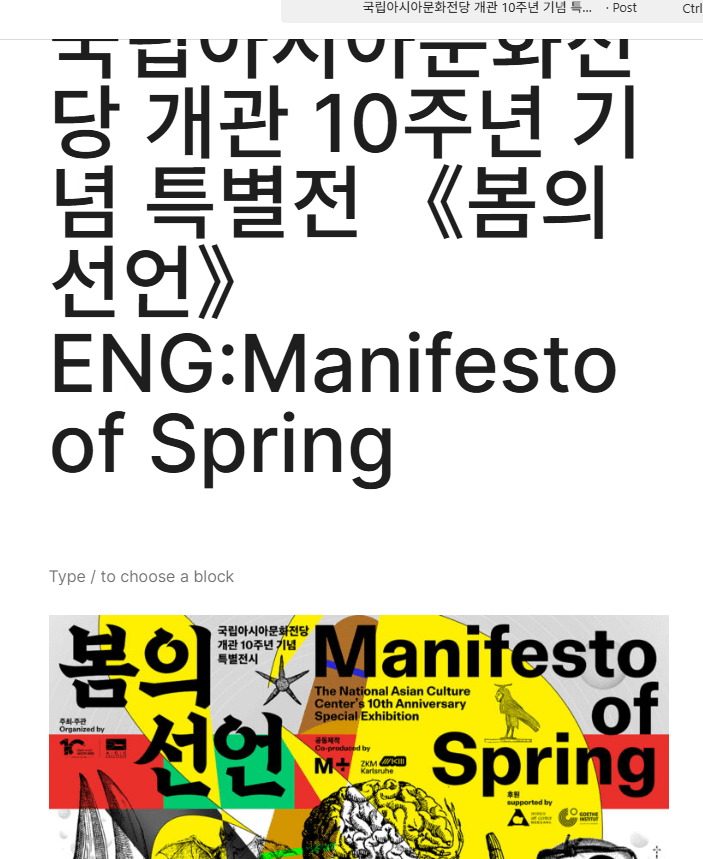
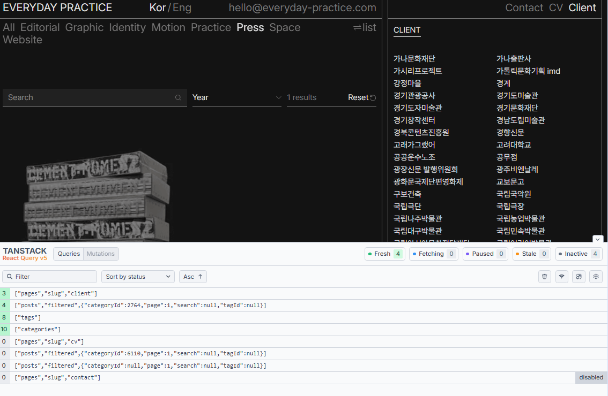
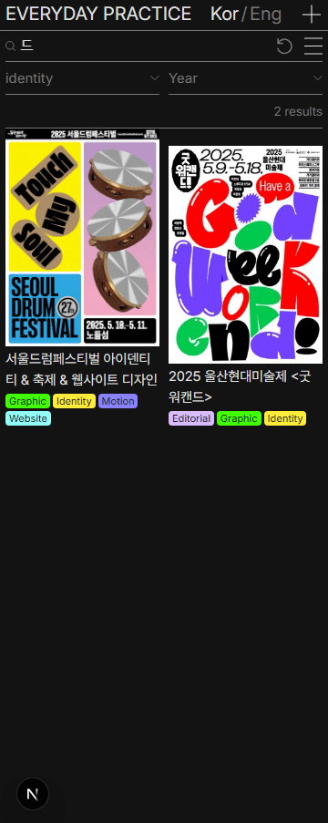
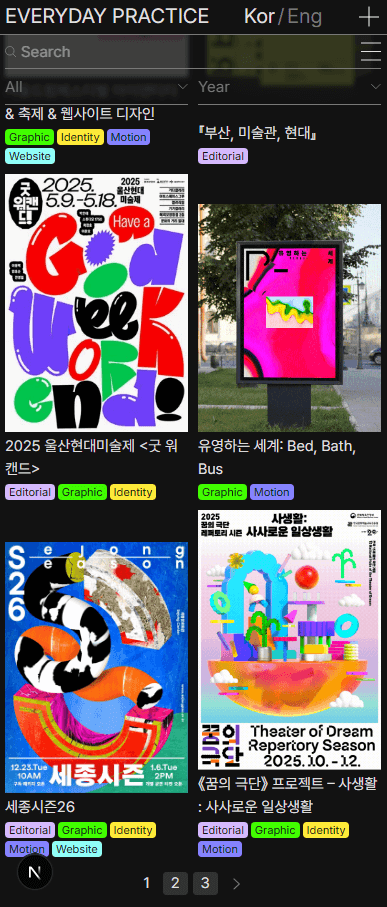
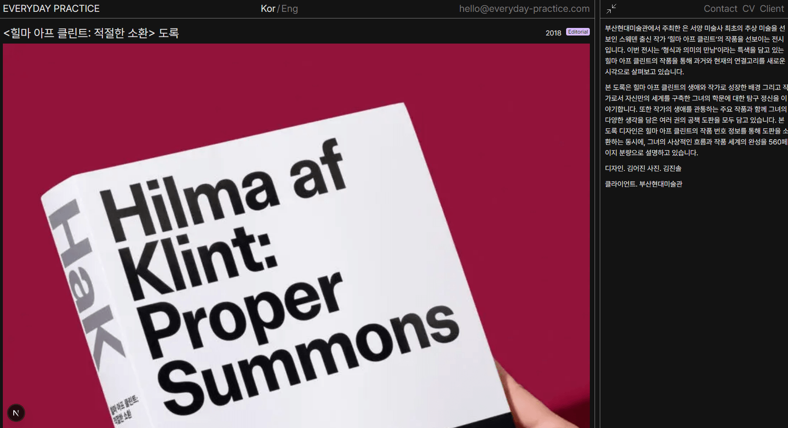

## 일상의 실천 - 데모



일상의 실천 웹사이트를 따라 만든 Next.js 기반 웹사이트입니다.
워드프레스 백엔드를 사용하고 있습니다.

### 소개

이 프로젝트는 Next.js를 사용해서 기존 워드프레스 사이트를 리워크한 프로젝트입니다. 포트폴리오 사이트인 만큼 seo가 중요하다고 판단되어, 가능한 부분을 최대한 ssr로 처리하고 분산해서 suspense와 hydration을 사용하는 방식으로 구현했습니다.
백엔드는 [wordpress](https://helloepseongeun.wordpress.com/wp-admin)를 사용해서 어드민 대시보드로 활용합니다.
호스팅이 필요 없는 wordpress.com을 사용했고, 무료 플랜인 만큼 acf나 별도 플러그인을 사용할 수 없어서 기본 필드를 최대한 활용해서 작업했습니다.
또한, 사이트의 데이터를 동일하게 가져오지 않고 다양한 테스트 값을 위해 변형해서 등록했기 때문에 원본 사이트와는 노출되는 값이 다를 수 있습니다.


사용 스택: Typescript, Next.js, TanStack Query, Tailwind CSS, clsx, twMerge, wordpress

### 실행

```
pnpm install
pnpm dev

```

### 프로젝트 분석
우선 먼저 기존 [일상의실천](https://everyday-practice.com/) 웹사이트를 분석해봤습니다.

기존 웹사이트는 facetWP를 사용해서 새로고침 없이 빠르게 필터링 + 페이지네이션을 처리하고 있고,
kinsta를 사용해서 호스팅 레벨에서 캐싱 관리를 하는 것으로 보입니다.
또한 이미지에 캐시 컨트롤을 max-age 10년 단위로 아주 긴 브라우저 캐싱을 활용해서 빠르고 부드러운 인터렉션을 제공하고 있습니다.

따라서 현재의 이런 장점을 두고 react (next.js)로 리워크하려면 그만큼 캐싱 관리가 중요할 것이라고 판단했습니다.

처음에는 [리액트](https://github.com/seoeongeueun/helloep)로 작업했으나, 이미지 캐싱 컨트롤과 seo 설정을 위해 next.js로 전환하는 과정을 거쳐 현재 프로젝트를 작업했습니다.

### CMS(워드프레스) 활용
CMS로는 실무에서 사용했던 워드프레스를 사용했습니다. 다만 개인 무료 계정은 acf를 사용하지 못하는 등 제약이 많아 최대한 기본 필드를 사용했고, 국문/영문 전환의 경우 모든 데이터에 영문 값을 등록하지 않았기 때문에 일부 국문으로 대체 노출하고 있습니다.
또한 wp-json 엔드포인트를 사용할 수 없어서, wp public-api를 사용하고 있습니다.



기본적으로 posts 타입을 사용해서 프로젝트를 등록했습니다. 



프로젝트 썸네일은 featured image에서 등록할 수 있고, 클라이언트 정보는 excerpt에서 등록한 값을 사용합니다. 




목록에서 해당 클라이언트 정보가 잘 등록된 것을 확인할 수 있습니다.




카테고리는 미리 등록해둔 카테고리 중에 선택 가능합니다.
tag 값으로 연도를 등록하고 있고, 등록된 값 중에 첫 번째 값만 사용하고 있습니다.




제목과 본문은 ENG: 를 기준으로 분리합니다. 통으로 전달받은 title 또는 content 값을 fetch 단계에서 파싱 단계를 거쳐 국문과 영문으로 나누어서 데이터를 캐싱합니다.

```
// HTML 엔티티 디코딩 반환
  posts = posts.map((post) => ({
    ...post,
    title: {
      rendered: decodeHtmlEntities(post.title.rendered),
    },
    content: {
      rendered: decodeHtmlEntities(post.content.rendered),
    },
    excerpt: {
      rendered: decodeHtmlEntities(post.excerpt.rendered),
    },
    title_en: decodeHtmlEntities(extractEnglishTitle(post.title.rendered)),
    title_ko: decodeHtmlEntities(post.title.rendered.split("ENG:")[0].trim()),
  }));
...
```

### 주요 기능
***레이아웃과 사이드바***
```
<HydrationBoundary state={dehydrate(queryClient)}>
                <div className="flex flex-col w-full">
                  <Suspense fallback={<div className="h-headerH bg-black" />}>
                    <Header />
                  </Suspense>
                  {children}
                </div>
                <SideBar />
              </HydrationBoundary>
...

```

기본 레이아웃을 투탭으로 page와 사이드바로 분리해서 페이지 전환 시에도 공통으로 사이드바를 사용해서 전환에 끊김이 없도록 구현했습니다.

```
import { getPages } from "@/actions";
import SideBarContent from "./SideBarContent";
import SideBarHeader from "./SideBarHeader";
import SideBarMobile from "./SideBarMobile";

// 먼저 ssr로 렌더 (client side compnent도 props는 받을 수 있기 때문)
export default async function SideBar() {
  const pageData = await getPages({ slug: "contact" });

  return (
    <>
      {/* 데스크톱용 사이드바 */}
      <aside className="hidden desktop:flex flex-col fixed left-0 w-[calc(100%-4rem)] border-r border-gray desktop:w-[29%] z-50 bg-black h-full desktop:sticky top-0 font-normal min-w-[40rem]  border-l border-px">
        <SideBarHeader />
        <SideBarContent data={pageData} />
      </aside>
      {/* 모바일용 사이드바 */}
      <SideBarMobile />
    </>
  );
}
```

사이드바는 기본적으로 서버 사이드로 처리하고, 디폴트로는 contact 정보를 서버데이터로 렌더링합니다.
내부인 content는 클라이언트 컴포넌트지만 초기 데이터를 부여받아 서버사이드로 렌더링할 수 있도록 만들었습니다.
초기 렌더링 이후에는 유저 인터렉션에 따라 해당하는 데이터를 동적으로 노출합니다.

```
// selectedProjectId가 있고 데스크톱 or 모바일에서 프로젝트 페이지일 때 프로젝트 정보 표시
  if (selectedProjectId && (!isMobile || isProjectPage)) {
    return (
      <>
        <Figures />
        <Caption />
      </>
    );
  }

  // 페이지 데이터가 없으면 null 반환
  if (!pageData) {
    return null;
  }

  // 정적 페이지 컨텐츠 표시
  return (
    <StaticPageContent data={pageData} slug={currentSlug as SidebarSlug} />
  );
```


```
const handleProjectSelect = () => {
    // 이미 데이터를 가지고 있기 때문에 파싱 후 바로 query에 추가해서 네트워크 요청을 스킵한다
    const parsed = parseWpPostDetail(post);
    queryClient.setQueryData(postsQueries.detail(post.id).queryKey, parsed);
    selectProject(post.id);

    //모바일은 클릭시 상세페이지로 이동
    if (isMobile) {
      const params = new URLSearchParams(searchParams.toString());
      router.push(`/${post.id}?${params.toString()}`);
    }
  };
```

불필요한 네트워크 요청을 줄이기 위해 이미 목록으로 받아온 프로젝트 정보를 query로 바로 전달해서, 상세페이지로 이동시에 캐싱된 데이터를 사용해 로딩 시간을 없앴습니다.


***상태 관리***
보통 별도 상태 관리 라이브러리를 사용하지만, 인터렉션 중심의 탐색용 웹사이트기 때문에 기본 context api를 사용해서 간단한 상태 관리를 했습니다.

```
type SidebarMode =
  | { mode: "page"; slug: SidebarSlug }
  | { mode: "project"; projectId: number };

// 언어와 사이드바 상태 관리
type AppStateContextValue = {
  language: LanguageMode;
  selectedProjectId: number | null;
  activeSlug: SidebarSlug | null;
  viewMode: ViewMode;
  setLanguage: (language: LanguageMode) => void;
  selectProject: (projectId: number) => void;
  selectPage: (slug: SidebarSlug) => void;
  setViewMode: (mode: ViewMode) => void;
};

const AppStateContext = createContext<AppStateContextValue | null>(null);

...
```

선택된 언어 정보를 가지고 전역으로 관리하며, 그에 맞는 국문/영문 제목을 노출합니다.

***캐싱과 페이지네이션***


데이터는 tanstack query를 사용해서 캐싱하고 불필요한 요청을 줄였습니다.

```
/**
 * postsQueries 객체는 게시글 데이터를 가져오는 쿼리
 * - detail: ID로 단일 게시글을 가져오는 쿼리
 * - filtered: 검색어, 카테고리, 태그, 페이지를 조합한 필터링 쿼리 (모든 파라미터 optional)
 * placeholderData 옵션을 통해 페이지 전환 시 이전 데이터를 유지하도록 설정하여 사용자 경험을 개선합니다.
 */
export const postsQueries = {
  detail: (id: number | null) => {
    return queryOptions({
      queryKey: postsKey.detail(id!),
      queryFn: async () => getPostById(id!),
      enabled: !!id, // id가 유효한 경우에만 쿼리 실행
    });
  },
  filtered: (filters: FilterParams) => {
    const { page = 1, search, categoryId, tagId } = filters;
    return queryOptions({
      queryKey: postsKey.filtered(filters),
      queryFn: async () =>
        getPosts({
          page,
          perPage: POSTS_PER_PAGE,
          ...(search && { search }),
          ...(categoryId && { categoryId }),
          ...(tagId && { tagId }),
        }),
      placeholderData: (previousData) => previousData,
    });
  },
};
```

또한 페이지 번호별로 데이터를 캐싱해서 페이지 이동에도 데이터 로딩이 매끄럽도록 구현했습니다.

***검색과 필터링***

```
if (search?.trim()) query.set("search", search.trim());
    if (typeof categoryId === "number")
      query.set("categories", String(categoryId));
    if (typeof tagId === "number")
      query.set("tags", String(tagId));

    //검색어 검색 범위를 제목+클라이언트(excerpt) 제한
    //본문으로는 검색하지 않는다.
    const response = await apiRequestWithHeaders<WPApiResponse | WPPost[]>(
      `${WP_BASE_URL}/posts?${query.toString()}${search ? "&search_columns[]=post_title&search_columns[]=post_excerpt" : ""}`,
    );
    data = response.data;

    const totalHeader = response.headers.get("X-WP-Total");
    const totalPagesHeader = response.headers.get("X-WP-TotalPages");

    totalFromHeader = totalHeader ? Number(totalHeader) : null;
    totalPagesFromHeader = totalPagesHeader ? Number(totalPagesHeader) : null;

...
```

검색 조건은 url의 params로 저장해서 요청 단계에서 파싱 후 wordpress에 요청을 보냅니다.
검색 범위는 제목와 클라이언트로 지정했습니다. 

또한 요청 헤더로 전체 검색 결과 개수와 페이지 수를 받아와서 각자 검색 결과와 페이지네이션 구성에 사용합니다.



다양한 조건으로 필터링한 결과 잘 적용되는 것을 확인할 수 있습니다.


***반응형 웹사이트***




```
@theme {
  /* min width 기준 breakpoints */
  --breakpoint-*: initial;
  --breakpoint-phone: 0px;
  --breakpoint-phone_large: 429px;
  --breakpoint-tablet: 639px;
  --breakpoint-desktop: 1023px;
  --breakpoint-desktop_large: 1769px;

...
```

빠른 구현을 위해 tailwind와 twMerge를 사용했습니다.
breakpoint를 기준으로 반응형 디자인을 제공합니다.
또한, 사이드바 컴포넌트의 분리를 위해 context로 모바일 여부를 판단해서 공용 상태로 사용합니다.

```
export function SidebarProvider({
  children,
  defaultOpen = false,
}: SidebarProviderProps) {
  const [state, setState] = useState<SidebarState>({
    isOpen: defaultOpen,
    isMobile: false, // 초기값, useEffect에서 실제 값 설정
  });

  // Desktop/Mobile 감지 및 사이드바 상태 관리
  useEffect(() => {
    const mediaQuery = window.matchMedia("(min-width: 1024px)");

    const handleMediaQueryChange = (e: MediaQueryListEvent) => {
      const isDesktop = e.matches;
      setState((prev) => ({
        ...prev,
        isMobile: !isDesktop,
        isOpen: isDesktop ? true : false, // Desktop에서는 무조건 열림, Mobile에서는 무조건 닫힘
      }));
    };

    // 초기 실행
    const isDesktop = mediaQuery.matches;
    // eslint-disable-next-line react-hooks/set-state-in-effect
    setState((prev) => ({
      ...prev,
      isMobile: !isDesktop,
      isOpen: isDesktop ? true : defaultOpen, // Desktop에서는 무조건 열림, Mobile에서는 defaultOpen 사용
    }));

    mediaQuery.addEventListener("change", handleMediaQueryChange);
    return () => {
      mediaQuery.removeEventListener("change", handleMediaQueryChange);
    };
  }, []);

...
```



원본 사이트를 참고해서 풀페이지 전환이나 모바일 뷰 전환에도 자연스럽게 레이아웃이 변경되도록 만들었습니다.


